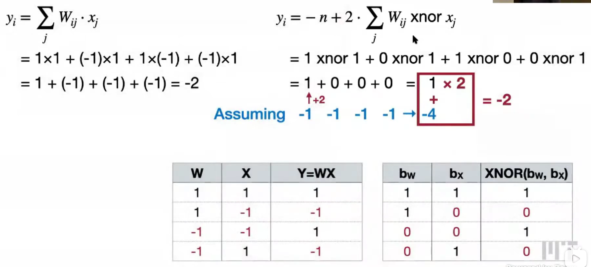

# Lec01 引入


# Lec02 基础

-   Fully-Connected Layer (Linear Layer)

    The output neuron is connected to all input neurons.

-   Convolution Layer

    The output neuron is connected to input neurons in the receptive field.

    1D conv, 2D conv, 还要在加上 channel 的维度

    1.   feature map 特征图的大小变化（公式）
    2.   Padding 填充，zero padding, others (reflection, replication, constant ...)
    3.   receptive field 感受野（公式）
    4.   strided，在不增加深度的情况下增大感受野
    5.   grouped conv, 减少计算量，初始版本，所有的 channel_i 和 channel_o 都是相连的，参数量会减少到原来的 g 倍（组数倍）
    6.   depthsise conv, 分组卷积的极限情况，
    7.   pooling layer，得到小的特征图，对高分辨率的图，max, average

-   Normalization Layer

    1.   BN, CNN, HW B
    2.   LN, atention, HW c
    3.   IN, HW
    4.   GN, HW g
    
-   Activation Function

    1.   sigmoid, 易于量化quantize，梯度消失
    2.   ReLU, 输入为正不会梯度消失，为负死了，易于实现稀疏性sparsify，不易量化
    3.   ReLU6，最大为6的ReLU，相对易于量化
    4.   Leaky ReLU，为负，失去稀疏性
    5.   Swish，x / (1 + e&-x)，硬件实现困难
    6.   Hard Swish
         -   0, <= -3
         -   x, >= 3
         -   x * (x + 3) / 6

# Lab0

熟悉pytorch用法

```python
lr_lambda = lambda step: np.interp(
  [step / steps_per_epoch],
  [0, num_epochs * 0.3, num_epochs],
  [0, 1, 0]
)[0]

steps = np.arange(steps_per_epoch * num_epochs)
plt.plot(steps, [lr_lambda(step) * 0.4 for step in steps])

scheduler = LambdaLR(optimizer, lr_lambda)
```

# Lec03 - 04 剪枝

-   Pruning at different granularities

    1.   fine-grained / unstructured, 细粒度剪枝，灵活，剪枝比率高，不好并行化

    2.   coarse-grained / structured, 

         	1. pattern-based，提供几种模式，模式旋转等方式，规律性
         	
         	N2M，N:M sparsity，不如 2:4，M个为一组，至少有N个被置零。
         	
         	需要用两位来表示非零，为了稀疏，需要花费额外的内存来存储索引
         	
         	2. vector-level 行
         	
         	3. Kernel-level 一块
         	
         	4. channel-level，拿掉一整个通道，加速简单，剪枝率低。
         	
         	设计不同层的稀疏度，uniform shrink 均匀压缩；xxx
         	
         	如何得到最佳稀疏度分配？AMC

-   Pruning Criteria 剪枝标准

    选最不重要的，heuristic 启发式

    1.   magnitude-based pruning，基于权重大小，绝对值最小的
    2.   scaling-based pruning，给每一个滤波器一个缩放参数，或者是channel，学n个参数就行，然后再去除靠近零的filter，因为Batch Normalization 中有缩放因子scaling factor，可以用来复用
    3.   second-order-based pruning，泰勒展开 - 海森矩阵 - 近似
    4.   neurons to prune，实际是去掉一行，一块核
    5.   percentage-of-zero-based pruning，用ReLU的时候，会出现零，然后看激活值的零的占比，去掉占比最高的，需要运行，得到activation tensor
    6.   regression-based pruning，

-   Finding pruning ratios

    大部分都是假设层与层之间是独立的

    1.   analyze the sensitivity of each layer，对每一层进行不同程度的剪枝，看准确率下降情况，设定降低5%~10%，画线对应过去，得到横坐标就是剪枝率
    2.   automatic pruning，自动剪枝
         1.   AMC: AutoML for Model Compression，RL
         2.   NetAdapt, rule-based iterative/progressive method，设定减小的延迟latency，每一层看需要剪枝多少才能达成，后面进行short-term fine-tune，在能够得到一样的结果──减小设定的延迟的情况下，选择fine-tune后准确率最高的剪枝，不断迭代，最后整体进行 long-term fune-tune

-   Fine-tuning pruned neural networks

    经验值，把学习率降低10~100倍

    1.   iterative pruning，迭代剪枝，边剪枝边微调，为了70%，经过 30% - 50% - 70%

-   System & Hardware Support for Sparsity

    1.   EiE，权重稀疏 + 激活值稀疏？

         对稀疏模型的硬件加速器设计

    2.   Tensor Core, M:N Weight Sparsity，相对规则，需要用2bit索引，乘法，用mask掩码

    3.   TorchSparsity & PointAcc，激活值稀疏，点云，稀疏卷积，不扩散，保持和输入的稀疏模式一致

         自适应分组，MM & BMM

         稀疏卷积硬件加速，归并排序找重叠部分

# Lab1

实现 VGG 在 Cifar-10 模型的fine-grained pruning细颗粒剪枝与channel pruning通道剪枝。

同时应用了，sensitive敏感性排序，参数量排序等实际优化剪枝的方法

# Lec05 量化

-   data type 数据类型，怎么样表示的

    1.   IEEE FP32 1符号 + 8指数 + 23尾数，single precision

    2.   IEEE FP16 1符号 + 5指数 + 10尾数，half precision
    
    3.   Google BF16 ，1符号 + 8指数 + 7尾数，Brain Float，有时 FP32 -> FP16 训练不稳定，可以换成 BF 16
    
    4.   Nvidia FP8 (E4M3)，1符号 + 4指数 + 3尾数，hopper
    
    5.   Nvidia FP8 (E5M2)，1符号 + 5指数 + 2尾数
    
         指数（数值范围、动态跨度大小），尾数（精度）
    
    6.   Nvidia INF4，1符号 + 3尾数，BlackWell
    
         FP4 (E1M2), (E2M1), (E3M0)
    
         E1M2 和 INT8一致，但是浪费应该 +- 0
    
-   Quantization 量化

    把输入从连续集合转换成离散数值集合的过程，之间的差异，称为量化误差，目标是最小化差异

    1.   存储、计算：浮点数，浮点数

    2.   K-Means-based Quantization，code book

         -   概念

             存储、计算：整数，浮点数

             节省空间；计算量不变

             存储的是代码本（k-means的质心）和分类的下标

             N-bit quantization 量化，#parameters = M >> 2^N

             32 bit x M = 32 M bit;  N bit x M = NM bit + 32bit x 2^N = NM + 2^(N+5) bit

             where 2^(N+5) bit can be ignored

         -   量化后微调 fine-tune

             得到梯度矩阵，把原本权重的分组，用在梯度矩阵上，求和，在权重的code book上去对应颜色的减掉 （乘学习率）

             这个图有点神奇的，两个结合，但是得到了更好的结果：

             

             先 剪枝 后 量化，降低量化工作量，降低量化误差

             低精度计算单元

             经验值，Conv，在4bits后，才下降明显；FC，在2bits后才下降明显；所以4bits保持不错

         -   其他的编码方式

             Huffman Coding 哈夫曼编码

             不同的权重出现的频率不同，变长编码策略

             出现多的，用短编码

             -   three-stage pipeline Deep compression

                 深度压缩三阶段流水线

                 1.   剪枝，减少权重数量
                 2.   量化，用k-means聚类算法，权重分组
                 3.   编码，huffman coding，出现频率

         3.   Linear Quantization

              -   概念

                  存储、计算：整数，整数

                  节省空间；减少计算量

                  原始参数权重 => 

                  （量化后的参数权重 - zero point (int) ）* scale(float)

                  r(fp) = (q(int) - z(int)) * s(fp)

                  q_min max 是确定的，

                  s = (r_max - r_min) / (q_max - q_min)

                  z = round(q_min - r_min / S)

              -   矩阵乘法运算

                  

                  为了防止溢出，计算是需要类型转换

                  括号内后两项是常数（输入的零点，权重的量化值），包括括号外一项是常数，可以提前算

                  零点不变，量化权重不变

                  经验值，缩放因子在 (0, 1)，权重w的分布，遵循正态分布，Z_w = 0，为什么（？）

                  当 Z = 0，S = r_min / (q_min - Z) = - |r|_max / 2^(N-1)

                  

                  

                  

                  

# Lec06 量化提高结果

-   Post-Training Quantization (PTQ)

    quantization granularity

-   Quantization-Aware Training (QAT)

-   更低的量化位数

    1.   binary quantization
    2.   ternary quantization

-   automatic mixed-precision quantization 混合精度量化

    每一层不一定要一样的精度

## Post-training Quantization

-   Quantization Granularity

    1.   Per-Tensor  Quantization

         对整个张量用一个缩放因子

         大模型上效果好，小模型精度下降

         原因：不同的channel的权重范围不一样

    2.   Per-Channel Quantization

         更精细，误差更小，存储更多的值

    3.   Group Quantization，在4bit及以下，很重要

         -   VS-Quant: Per-Vector Quantization

             全局浮点缩放因子，局部整数缩放因子

             Multi-level scaling scheme 多级缩放

         -   Shared Micro-exponent(MX) data type

             L0 和 datatype 是共享的

             

-   Dynamic Range Clipping 动态范围裁剪

    收集激活值的统计信息，在部署模型之前

    1.   During Training 在训练的同时

         Exponential Moving Averages (EMA)

         维护 r_min, r_max，r(t) = alpha * r(t) + (1-alpha) * r(t-1)，平滑维护动态范围

         （必须参与在训练）

    2.   calibration batch 训练后

         不过可以使用多训练一个batch，用calibration校准数据集，估算动态范围

    可能不希望用真正的最大值

    1.   最小化 MSE 均方误差

         假设是高斯分布或者拉普拉斯分布，最两端的地方数量其实少，有对应封闭解

         但实际符合这样分布的输入数据很少

    2.   最小化损失的信息

         使用 KL divergence散度来校准量化范围

-   Rounding 舍入

    权重之间是相关的，舍入到最近的值不一定是最好的

    1.   Round-to-Nearest

    2.   AdaRound

         引入可学习的 delta 然后再四舍五入

## Quantization-Aware Training (QAT)

量化感知训练，fine-tuning 恢复精度

K-means-based 量化，fine-tuning，更新质心即可

-   线性量化？

    Simulated quantization 模拟量化，fake quantization 伪量化

    在训练的时候，维护一个全精度的参数权重，能累计非常小的梯度

    再加上对激活值的量化的过程

    增加这两个量化节点 Q(W), Q(Y)

    训练好后，全精度参数权重就被抛弃

    量化激活，阶跃的，梯度是0

-   Straight-Through Estimator (STE)

    把weight-quantization node看成恒定函数 Y = X，传递梯度

## Binary/Ternary Quantization

-   概念

    Binary Weight Networks (BWN)

    储存，计算：Binary/Ternary，Bit Operations

    1.   deterministic binarization 确定性二值化

    2.   stochastic binarization 随机性二值化

         需要随机数生成硬件

    精度下降大，量化误差大，再次引入缩放因子，1/n * |W|_1

    啊？量化误差变化不大，精度能提升，从-21.2% 能到 0.2%？

    激活值的二值化？

    XNOR 同或，用他来代替乘法

    默认值，0 是 -1，1 是 +2，起因也是有 XNOR 硬件计算快

    

    y = -n + popcount(W_i xnor x)  << 1

-   Ternary Weight Networks (TWN)

    和 delta 比较，得到 +1 -1 0，经验值，0.7 * E(W)

    同样缩放系数

    

    Trained Ternary Quantization (TTQ)

    可以再引入，正缩放系数 Wp 与负缩放系数 Wn 
    
-   降低精度的时候，内存是线性下降，计算量，模型表达能力，二次下降

## Mixed-Precision Quantization

混合精度量化

设计的空间很大

Hardward-aware automated quantization with mixed precision (HAQ)

# Lab2

K-means Quantization

QAT，简化，k-means直接用权重再更新

训练/微调的时候是伪量化，部署时才是真量化

Linear Quantization

# Lec07 NAS 神经网络结构搜索

Neural Architecture Search (NAS)

不同于前面的训练、推理的优化，这是模型结构的优化

1.   ResNet，1x1 卷积，bottleneck block

     

2.   ResNeXt，1x1 分出来channel，分组卷积

     

3.   MobileNet: depthwise-separable block

     空间信息depthwise和通道信息pointwise，分开区分

     depthwise conv 表达能力弱

     

4.   MobileNetV2: inverted bottleneck block

     和bottleneck相反，中间增大

     激活值的特性不好

     可以用来减小模型大小和计算量，但激活内存不能（训练常常是激活内存为瓶颈）

     

5.   ShuffleNet

     混洗shuffle，促进不同通道的信息的流动

6.   Transformer

     Multi-Head Self-Attention (MHSA)

     感受野一层就可以全了


-   Search Space

    1.   Cell-level search space

         重复使用两种、

         reduction cell 归约单元，降低分辨率

         normal cell 普通单元

    2.   Network-level search space

         1.   TinyML，内存更关键，在同样的内存限制下有更高FLOPs更好

-   搜索策略

    1.   Grid search 网格搜索

         需要训练，根据各个指标剔除

         compound scaling 复合缩放

    2.   Random search

         同样的搜索空间，但是随机变化，快速评估

    3.   Reinforcement learning

         决策序列

    4.   Gradient descent

         指标考虑，计算选择概率

    5.   Evoluitionary search 进化算法

         变异、交叉等

-   Performance Estimation Strategy

    1.   Train from scratch

         成本高

    2.   Inherit weight

         从预训练的基础上，继承权重，拆分点，保持数学等价，改变深度、宽度

         降低成本 net-to-net

         

    3.   Hypernetwork

         用网络来预测网络参数，层作为node embedding

         init embedding => final embedding 生成权重

         用来降低训练成本

# Lec08 NAS 更高效

定制模型

前面的 NAS 太贵，选择proxy task代理任务，如更小的数据集，更少的训练轮数，FLOPs，参数量等

但是proxy task的相关性可能也没这么好。

1.   ProxylessNAS

     路径级二值化，指走概率最高的路径

     训练按概率，推理选概率最高

     

     -   MACs 不等于真实硬件效率

         需要用真实硬件，效率低？并行！太贵？用延迟预测模型『架构，延迟』，最简单的模型是查询表，算子和延迟（一层一层的测延迟，相加）

         GPU会有 kernel fusion，两个kernel 可能会变成一个kernel 而变快

         计算密集型的两个，通畅不能kernel fusion，如两个矩阵乘法

         但矩阵乘法 + 非线性激活函数是可以的，计算密集型 + 内存密集型

         GPU会在更浅、更宽的表现好，CPU在更深、更细的表现好（对自己设备来说）

     -   每个设备都要重新训练一个太贵，Once-For-All approach

         同时训练多个模型？

         用一个单一模型，包含许多子网络，稀疏激活

         相比之前的重新训练，现在只需要在小型网络中抽取不同的subnetwork子网络就行了

         设备不同，电量不同（适应不同能耗）等

         -   共享参数，不同子网络之间相互干扰？elastic 弹性的

             1.   卷积核大小，不采用单独不同的卷积核大小，而是选择用变换矩阵处理，只用一个 7x7 的参数就好，小的参数都在7x7的内部
             2.   深度，shrink the depth 归约深度
             3.   通道，通过不同channel的magnitude幅值，对重要性进行排序，选择前 i 个通道

             

         -   Roofline Analysis 屋顶线分析

             折线图，X-获得一个字节的操作数，Y-GFLOPS 浮点算力

             computation is cheap; memory is expensive.

             内存瓶颈，计算瓶颈。

2.   Zero-shot NAS

     原本需要需要训练才知道评估acc准确率，变成只要看它的结构，推测是否能拿到高的准确率

     ZenNAS, GradSign（感觉很直觉地开始套娃）

     1.   ZenNAS 启发式

          random weights 随机权重，粗略估计，结果不错

          1.   随机初始化输入，符合正态分布

          2.   加入小的扰动

          3.   再把所有的权重，映射到正态分布

          4.   论文指出，z = log(f(x') - f(x))，如果模型效果好，应该对模型输入感到敏感，也就是说两个输出的差值应该大

          5.    \+ batch normalization variance 批归一化（另一种启发式）

               对于不同的批次，方差大好

               计算每层的方差均值，加起来，希望这个方差越大越好

               这样，不同的输出，容易得到不同的结果

     2.   GradSign

          好的模型会非常密集的sample-wise样本级局部最小值，两个局部最小值应该非常接近

          在图中，绿色是梯度符号相同的部分，好的模型绿色部分应该更大，红色部分小

          在初始点附近，随机选择些点，计数梯度符号相同的数量。

          

-   Neural-hardware achitecture co-search，设计硬件

    不仅搜索神经网络架构，也搜索加速器架构

    硬件结构上会有些「非数值参数」需要设计，如连接性

    1.   temporal mapping 时间映射

         顺序处理

    2.   spatial parallelism 空间映射

         空间并行处理

    两种 embedding，选择并行维度与顺序维度，分别按照重要性排序

    

-   应用

    1.   Once-for-ALL for Transformer and NLP

         -   HAT

    2.   3D建模

    3.   GAN

         小模型预览结果，大模型输出结果

    4.   Pose estimation

    5.   Quantum AI 量子

         搜索最佳电路门

# Lec09 知识蒸馏 KD

Temperature 温度，高的温度，不同的区别越小，smooth，T在softmax的x => x / T

## 匹配/对齐什么？

1.   对齐中间权重 matching intermediate weights

     难点，维度不一样低秩近似/全连接/

2.   中间特征 intermediate future / activation matching

     激活值，中间的结果，也是相似的

3.   梯度 Gradients

     计算权重梯度或计算激活值梯度匹配

     表现好的模型的注意力图是相似的

4.   稀疏模式 sparsity patterns

     来源于激活函数 ReLU 例如。

5.   Relational information

     -   不同的层之间 C_in x C_out
     -   不同样本之间，同一个模型，不同样本输入的不同输出之间的关系

## online distillation 在线蒸馏

### self-distillation

教师模型和学生模型架构一致

教师模型正常训练，学生模型用教师模型的交叉熵概率来训。

用前一步的作为教师模型，后一个以前一个为结果，

最后把所有模型ensemble，得一个更好的结果

### Deep Mutual Learning 互学习 DML

两个不一定相同的模型架构，互为师生，N1训练时，N2指导，反之亦然。

真实标签的交叉熵误差 + KL散度 两者结果

不需要预先训练，教师模型不一定要比学生模型大。

### Combined 前面两种方法结合 Be Your Own Teacher: deep supervision + distillation

用深层网络输出，作为浅层网络的教师，来自统一模型的不同部分。


蒸馏损失，在对真实标签的结果上，教师模型比学生模型的效果好时才能作为教师

物体识别，也可以看成（区域）分类


### 增强小模型的效果

容易过拟合，做数据增强 cut out, mixup, dropout

容易欠拟合，做网络增强，NetAug，基础模型扩展

# Lec10 MCUnet TinyML

## 瓶颈

参数数量，峰值激活，与，内存

## TinyNAS

Resolution 分辨率 和 Width Multipler 宽度调节因子

1.   Automated search space optimization 自动搜索空间优化

     分析满足限制的模型的FLOPs分布，在各自的搜索空间中，高FLOPs=>高模型能力=>更可能高ACC

     在同样的内存限制下，能有更高的运算量的设计空间更好

     Flash 存储权重，SRAM 存储激活值

     （最好的配比）

     Flash↑，宽度调节因子（通道数）↑，分辨率↓，否则在 SRAM 中存不下 分辨率 x 通道数

     SRAM↑，宽度调节因子基本不变，分辨率↑

2.   Resource-constrained model specialization 资源有限的模型特化	

层的内存的峰值最小

### Patch-based Inference 分块

不再是 per-layer 整层输入输出，改为 per-patch，分成几部分输入输出

-   坏处，增加了latency延迟，限制了并行能力（不过微控制器的并行能力是弱的）

    卷积的重复计算，感受野，多了重叠的部分。感受野扩展

-   可以调整（减小早期的感受野，1x1，减少分块阶段的卷积层），总的需要不一样，在后面增加回卷积层，消除影响

    早期用 分块推理，后期降下来，是正常推理

    

-   再把这种分块推理的方式，放入搜索空间，推理调度

-   可以支持更大的输入分辨率

### 应用

-   Tiny Vision

    classification, visual wake words，检测任务 分辨率敏感（相比分类），所以分块推理，能使得分辨率提高

    on-device training

-   Tiny Audio

    二维语音，（时间，频率）功率，conv，相邻的频率、时间关联

-   Tiny time series/anomaly detection 微型时间序列异常检测

    异常事件、产品（autoencoder，符合正常分布，重建误差小，不符合，误差大）

    VLA，多个任务

# Lec11 TinyEngine

## Loop optimization 循环优化

### Loop reordering 循环重排

让访问内存更符合 cache line，连续访问

矩阵乘法 i, j, k => i, k, j，虽然输出访问变得不连续，但是还是会被cover掉

### Loop tiling 循环分块

内存访问就 N\*N => N\*Tiling_size => Tiling_size \* Tiling_size

内存局部性，降低缓存未命中

一般循环内层往外吧（？）

for ti, N block

​	for ti, ti + block

#### 两层缓存？

设置第二层分块大小，多层次的分块 Tile2，和L2 cache 大小设计

## Loop unrolling 循环展开

分支预测，for 条件判定，循环展开，减少分支；但会增加重复代码，增加二进制文件大小

## SIMD (single instruction, multiple data) programming 单指令多数据

### ISA (Instruction set architecture) 指令集架构

#### CISC (Complex Instruction Set Computer) 复杂指令集计算机

Intel x86

并行处理范式

Vector Register，向量寄存器

Vector Operation，向量运算

提高吞吐量，速度

#### RISC (Reduced Instruction Set Computer) 精简指令计算机

Arm, RISC-V


## Multithreading 多线程

```cpp
pthread_t threads[N];
ThreadData thread_data[N];
pthread_create(&threads[i], nullptr, func, &thread_data[i]);
pthread_join(threads[i], nullptr);
```

### OpenMP

编译器指令

```cpp
omp_set_num_threads(4);

#pragma omp parallel for
for(int i = 0; i < N; i ++) {
    for(int j = 0; j < N; j ++) {
        for(int k = 0; k < N; k ++) {
            C[i][j] += A[i][k] * B[k][j];
        }
    }
}
```

### CUDA

MMA 矩阵累加

## Inference Optimization

### Image to Column (Im2col) convolution

### In-place depth-wise convolution

### NHWC for point-wise convolution, NCHW for depth-wise convolution

### Winograd convolution


# Lec12 Transfomer & LLM

## Transformer 基础

...

## Transfomer Design Variants 变体

### Encoder-Decoder (T5)

### Encoder-only (BERT, Bidirectional Encoder Representations from Transformers)

-   Masked Language Model (MLM)
-   Next Sentence Prediction (NSP)

### Decoder-only (GPT, Generative Pre-trained Transformer)

-   Next word prediction

## Absolute/Relative Positional Encoding

-   绝对位置编码

    嵌入输入中

    贯穿整个Transfomer过程

-   相对位置编码

    只在注意力机制的部分

    能处理更长的上下文，train short, test long

    1.   ALiBi (Attention with Linear Biases)

         

    2.   RoPE (Rotary Positional Embedding)

         LLaMa

         把长的嵌入转为二维的形式，(d1, d2)

         interpolating 插值，当 m 翻倍，为了保持还能正常表示，theta / 2

         

## KV cache optimization

需要 KV，才能在 Q 的时候，算出对应的 注意力

新token进来，没有 KV cache，则需要重算 KV？？？


### Multi-Head Attention (MHA)

n heads for query, n heads for key/value

KV cache 大小会乘以 n_kv，太大

### Multi-Query Attention (MQA)

n heads for query, 1 head for key/value

会大大削弱模型能力

### Grouped-Query Attention (GQA)

折中

n heads for query, G heads for key/value (typically G = N/8)

在大模型下，准确率和 MHA 差不多


## FFN => SwiGLU (Gated Linear Units)


## LLM

-   LLaMa

    1.   LLaMa

         Decoder-only, Pre-norm,SwiGLU(swish,gatedlinearunits), rotary positional embedding (RoPE)

         7B model_d 4096, 32 heads

         65B model_d 8192, 64 heads

    2.   LLaMa 2

         上下文更长 2k => 4k

         GQA 分组询问注意力

    3.   LLaMa 3

         多语言 token

-   Mistral-7B

    滑动窗口注意力机制，扩展上下文

数据和模型参数一起变大。

# Lec13 LLM Deployment Techniques


## Quantization

### Weight-Activation Quantization: SmoothQuant

前面提到的哪些朴素的量化方法对LLM，其实效果不好

原因：outliers 异常值，某些激活值很大，破坏精度

激活值，个别异常高的channel，蓝色部分将被舍入零；

权重值，一般都比较小，ez。

取舍，smooth bond：

考虑到权重和激活值是线性矩阵运算，所以，比如激活值乘 0.1，权重乘 10，结果不变。


1.   Calibration Stage

     找到激活值 col_max，找到权重 row_max，相除得到缩放因子 s = \sqrt(col_max / row_max)

     

2.   Smoothing Stage

     应用缩放因子

     

3.   Inference (deployed model) 部署

     没有再缩放，编译的时候处理了（fuse 到前一层）

为什么单节点比分布式好，communication overhead

### Weight-Only Quantization: AWQ and TinyChat

**W4A16** for Single-batch single user server

单用户，就是 batchsize 是 1，计算瓶颈是 weight

weight在边缘设备的LLM推理中的影响

1.   上下文与生成阶段，生成阶段是瓶颈
2.   生成阶段受限于内存通讯
3.   weight的占用内存的大小，比activation大多了


#### AWQ: Activation-aware Weight Quantization

传统 RTN（Round To Nearest）FP16 => INT3，clip()，降低很多。

？？？

只要保留一行，即1%channel，的关键权重，幻觉显著下降！

怎么找出这 1% 呢？

在量化权重的过程中，不关注权重的情况，而是关注激活值的情况！

因为下一层的激活值，是由权重与上一层的激活值相乘得出，所以，激活值大的，保留，

也是前面说的少量的异常值outlier

但是同个张量中出现fp16 和 int8，很难实现，会引入**混合精度**的计算，变得麻烦。

其实是不必要引入的，借用前面SmoothQuant中用到的方法，把权重的敏感性转给我们保持不变的激活值

相当于增加一位的精度

不需要反向传播，不需要基于回归的方法，只需要 calibration 校准数据集。

（Perplexity 困惑度 是衡量语言模型质量的一个指标，和真是输出的比较，越小越好）


#### TinyChat: LLM Inference Engine on Edge

##### Hardware-aware packing

怎么解决 4bit 和 1字节 对不齐的问题？

改变存储方式，为了更好地解码，交错存储


##### Kernel Fusion

Kernel call 很贵，做融合，BMM，批量矩阵乘法

### QServe (W4A8KV4)

#### 背景-融合两者的优点


#### SmoothAttention

类似与SmoothQuant，Q 是平滑的，K 会有某些通道有outlier异常值

#### 反量化，由于溢出可能要调整计算方式

改变位数之后，负数的话，乘一个数，可能下溢出了，所以可以先乘再加减

先缩放还是先加减。


## Pruning & Sparsity

### Weight Sparsity: Wanda

传统：看权重本身magnitude

Wanda：关注最终激活值小的，对应的权重

### Contextual Sparsity

#### DejaVu (input dependednt sparsity)

？

#### MoE (Mixture-of-Experts)

提高总参数，不提高推理代价

router路由器分配workload工作

##### 路由机制

token选择expert

expert选择token

全局expert分配

### Attention Sparsity

#### SpAtten (token pruning & head pruning)

Q-K，K列的attention sum，大 = 重要


#### H2O: token pruning in KV cache


## LLM Serving Systems

### Important Metrics 指标 for LLM Serving

-   Time To First Token (TTFT)，响应速度，实时互动
-   Time Per Output Token (TPOT)，每个token所需时间 100 ms/token, 10 token/s
-   Latency = (TTFT) + (TPOT * number of token to be generated)，总延迟
-   Throughput，对所有请求的每秒产生的 token 数

### 优化目标

最小 TTFT，最大 throughput，减小 TPOT，后两个需要 tradeoff，常矛盾

常用启发式：输出长度，输入长度，模型大小

### Paged Attention (vLLM)

#### KV Cache  的资源浪费

1.   Internal fragmentation：内部碎片化，由于不知道输出长度，过度分配空间
2.   Reservation：预留碎片化，现在步骤没用，未来会用
3.   External fragmentation：多个request，不知道sequence长度，要空出位置


#### 解决 / PagedAttention的好处

由 OS 操作系统的 virtual memory and paging 虚拟内存和分页机制启发

交替使用 KV blocks

1.   解决 **KV-cache** 内存碎片化，支持**多访问** requests
2.   动态块映射 使得 能够 **共享 Prompt**


### FlashAttention

生成attention注意力矩阵时，NxN 很大

tiling + kernel fusion

### Speculative Decoding 推测性解码

小模型 Draft model，生成

大模型 Target model，验证

小模型自回归生成，大模型并行验证（因为大模型运行比较贵）

纠正，重新生成

### Batching

增加吞吐量

-   no batching，不做批处理
-   static batching，静态批处理，固定批次大小
-   dynamic batching，动态批处理，批次大小到了，或者时间到了
-   continuous batch (in-flight batch)，连续批处理，token级别


# Lec 14 LLM Post-Training

## LLM Fine-Tuning 微调

### Supervised Fine-Tuning (SFT) 监督微调

对齐人类价值观/偏好，比如说话更加友好，更加善解人意

helpfulness & safety

### Reinforcement Learning from Human Feedback (RLHF) 基于人类反馈的强化学习

BLEU、ROUGE的测试，客观答案，RLHF 更加主观，人类定义的创造性、可信的、有用的

#### 朴素的

奖励模型训练──数据生成结果，人类对不同结果排序，比较函数，排序前的大大大于后的

两方面

1.   调整后的模型，不会过拟合奖励模型，和原始模型的内容不能偏差过多
2.   奖励模型下的结果不错，符合人类偏好

三个模型，两个损失值

#### Direct Preference Optimization (DPO) 直接偏好优化

简化流程，转化为单流程的 SFT 任务


### Parameter Efficient Fine-Tuning (PEFT)

#### BitFit (Fine-tune only the bias terms) 只微调偏置项

微调权重需要存储激活值，但微调偏置项不需要存储激活值

#### TinyTL: Lite Residual Learning

在主干网络计算量较大的基础上，添加轻量级的侧分支，只更新侧分支，学习残差

下采样 group conv, 1x1 conv，上采样，激活规模小

#### Adapter 插入适配器层

Adapter Layer：残差，下采样 激活 上采样，bottleneck

对每个任务，只添加一些可训练的参数

会增加模型深度，增加计算开销，延迟增加

不改变模型？

#### Prompt Tuning

可以训练连续的prompt，学习prompt

#### Prefix-Tuning

Prompt-Tuning 只对第一层有提示 => 对每一层有提示

增加输入损失，KV cache 使用变大，延迟变大

不引入额外推理延迟？

#### LoRA

同样训练侧分支

从 d 维 => 低秩 r 维（高斯分布初始化），低秩 r 维 => d 维（零初始化）

最初添加，不会有影响

h = x @ W + x @ A @ B = x @ (W + A @ B)  = x @ W'

没有非线性激活，所以可以fuse到原本的矩阵乘法

#### QLoRA

同样 LoRA 的设计原则，加上对骨架模型的量化

1.   引入 NormalFloat (NF4)，centroid 不是学到的，是固定的
2.   双重量化 Double quantization，缩放因子也被量化

CPU卸载功能的分页优化器，优化状态不用时，存放在CPU，节省内存

#### Bit-Delta

Your Fine-Tune May Only Be Worth One Bit

出发点是，模型已经学得很好了，微调只需要加一点点参数就好

能不能就微调 1 位，把增量量化至一位，还有一个缩放因子

二值化delta，sin(delta) > 0 => 1 else -1


## Multi-model LLMs

### Cross-Attention Based: Flamingo

将视觉信息注入inject到语言模型

LLM 参数固定，加入cross-attention layers

视觉信息 KV，文本信息 Q

### Visual Tokens as Input: PaLM-E, VILA

全部都 tokenize，视觉信息tokens

解冻LLM参数；

交错使用图文，而不是图文对，否则LLM性能下降严重；

混合数据，还是需要纯文本数据

分辨率重要


高分辨率的处理，分块多少，看任务，OCR 分块多好；知识推理不一定

QKV，把低分辨率作为 Q，高分辨率作为 KV

### Enabling Visual Outputs: VILA-U

统一图像和文字理解

## Prompt Engineering

### In-Context Learning (ICL)

zero-shot few-shot

### Chain-of-Thought (CoT)

let's think step by step

### ReTrieval Augmented Generation (RAG)

# Lec15 Long-Context LLM

